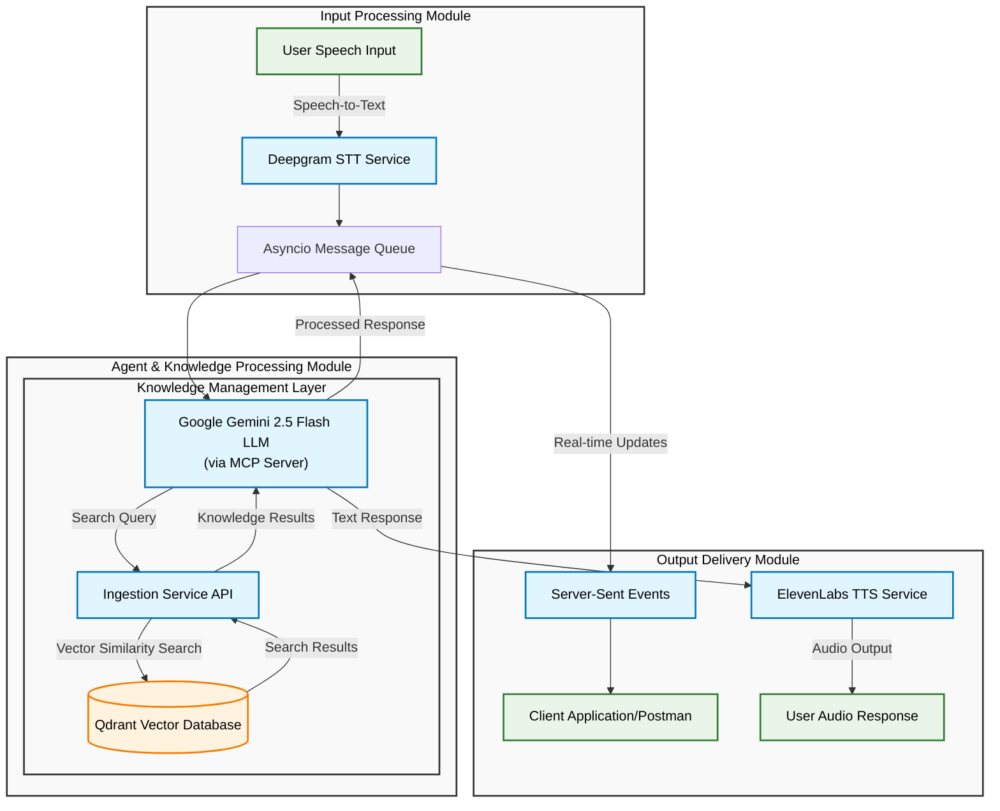

# RAG Voice Bot

RAG Voice Bot is an **end-to-end voice-based Retrieval-Augmented Generation (RAG) assistant**.  
It enables users to ask questions through speech and receive responses as natural speech, powered by **Qdrant**, **LangChain**, **Deepgram**, **Google Gemini**, and **ElevenLabs**.  

The system is designed with a **modular ingestion pipeline**, an **MCP server for retrieval coordination**, and a **voice agent** that handles user interaction seamlessly.  

---

## Features

- **Voice Input → Text**: Speech converted to text using **Deepgram**.  
- **Document & URL Ingestion**:  
  - URLs crawled using **Crawl4AI**.  
  - PDFs processed with **PyPDF**, extracting text **page by page**.  
- **Chunking**: Smart semantic chunking via **LangChain Semantic-Chunker**, backed by **BAAI/bge-small-en** embeddings.  
- **Knowledge Base**: Stored in **Qdrant VectorDB** (deployed on GCP free instance).  
- **Similarity Search**: Qdrant queried via the ingestion service (`/search` API).  
- **LLM Agent**: Powered by **Google Gemini 2.5 Flash** (via `google-adk LLMAgent`).  
- **Text → Voice Output**: Responses synthesized with **ElevenLabs TTS**.  
- **Async Messaging Pipeline**:  
  - `asyncio` Message Queue for task orchestration.  
  - Responses streamed via **SSE** (currently Postman used for testing).  
- **Modular Ingestion Sources**: Implemented using **Factory Design Pattern** for easy extensibility.  
- **Configuration**: Managed with **Pydantic Settings** + **LRU Cache** (optimized `.env` loading).  
- **Monitoring & Tracing**: Integrated with **Opik** for agent observability.  

---

## 🏗️ Architecture Overview



## 🚀 Quick Start

### Prerequisites
- Python 3.8+
- Poetry
- API keys for: Deepgram, Google ADK, ElevenLabs

### Installation

```bash
git clone https://github.com/RoboJunior/Voice-Agent.git

cd voice-rag-agent/

# Install ingestion
cd ingestion/
poetry install

# Intall mcp server
cd tools/
poetry install

# Install voice agent
cd agents/
poetry install

```

### Start Services
```bash
# To Create a new session session in qdrant
poetry run create_new_collection "<new-collection-name>"

# Start the voice agent
cd agents/
poetry run voice_agent

# Start the MCP server
cd tools/
poetry run mcp_server

# Start the ingestion service
cd ingestion/
poetry run ingestion_service
```

## 🔌 API Endpoints

### Ingestion Service
```http
POST v1/ingest/data
GET v1/ingest/search
```

### MCP Server
```http
POST /mcp
```

## 🔗 Technology Stack

| Component | Technology |
|-----------|------------|
| **Web Crawling** | Crawl4AI |
| **PDF Processing** | PyPDF |
| **Text Chunking** | LangChain Semantic Chunker |
| **Embeddings** | BAAI/bge-small-en |
| **Vector Database** | Qdrant (GCP) |
| **Speech-to-Text** | Deepgram |
| **Large Language Model** | Gemini 2.5 Flash |
| **Agent Framework** | Google ADK |
| **Text-to-Speech** | ElevenLabs |
| **Protocol** | MCP (Model Context Protocol) |
| **Monitoring** | OpIK |
| **Streaming** | Server-Sent Events (SSE) |

## 🎥 Demo Video
Here is the Demo of the Voice-Agent along with Opik Observability
